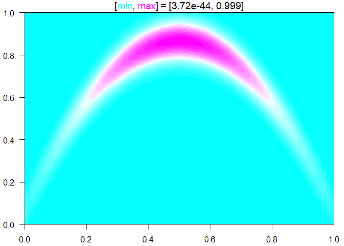

<!-- README.md is generated from README.Rmd. Please edit that file -->
TestFunctions
=============

[](https://travis-ci.org/CollinErickson/TestFunctions)

Why should I use it?
--------------------

This R package provides functions for various surfaces that can be used for testing of models, algorithms, etc. For example, if you want to compare how well a neural network does compared to a random forest, you can take data from one of these test functions to train and test them.

How do I use it?
----------------

Each of the test functions is called like any other function. The first argument, `x`, should be a vector representing one point or a matrix that has points in its rows. This can cause problems if you are using a 1-dimensional function and pass in a vector of values. Instead you should pass them in as a matrix with a single column, or vectorize the function.

``` r
set.seed(0)
library(TestFunctions)
branin(runif(2))
#> [1] 9.476405
branin(matrix(runif(20), ncol=2))
#>  [1]  24.119600  71.180268  18.374071   9.839029  36.607437  72.884496
#>  [7] 196.302169  25.185022  13.059216  27.129463
```

``` r
ContourFunctions::cf(banana)
```



How do I get it?
----------------

Install it like any other package with `install.packages`.

    install.packages("TestFunctions")

    # Or the the development version from GitHub:
    # install.packages("devtools")
    devtools::install_github("CollinErickson/TestFunctions")
